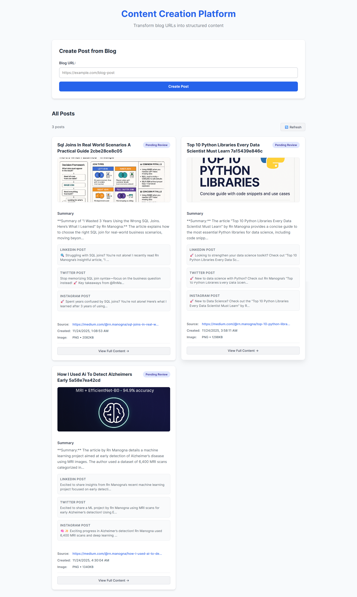

# ContentForge AI

**ContentForge AI** is an intelligent content generation platform that transforms blog posts into engaging social media content. Using cutting-edge AI models and multi-agent orchestration, it automatically creates platform-specific posts for LinkedIn, Instagram, and Twitter, along with AI-generated imagery.

##  Features

- **Blog Content Scraping**: Automatically fetches and extracts content from blog URLs
- **AI-Powered Summarization**: Condenses blog content into concise summaries
- **Multi-Platform Social Posts**: Generates tailored content for:
  - LinkedIn (professional tone)
  - Instagram (casual, engaging)
  - Twitter/X (concise threads)
- **Intelligent Review Agent**: Validates grammar, style, and platform compliance
- **AI Image Generation**: Creates infographic-style images using Gemini/OpenAI
- **Cloud Storage**: Uploads images to Cloudinary for easy distribution
- **MongoDB Integration**: Stores all generated content and metadata in a centralized database

##  Tech Stack

### Backend
- **Framework**: FastAPI (Python)
- **Web Scraping**: BeautifulSoup4, Firecrawl API
- **AI/LLM**: LangChain, OpenAI, Google Generative AI
- **Image Generation**: Google Vertex AI (Gemini), OpenAI
- **Cloud Storage**: Cloudinary
- **Database**: MongoDB
- **Async Support**: ASGI with Uvicorn

### Frontend
- **Framework**: React 19 with TypeScript
- **Build Tool**: Vite
- **HTTP Client**: Axios
- **Routing**: React Router DOM
- **Styling**: CSS

##  Project Structure

```
ContentForge-AI/
├── Backend/
│   ├── main.py                 # FastAPI application entry point
│   ├── requirements.txt         # Python dependencies
│   ├── pyproject.toml          # Project configuration
│   ├── .env                    # Environment variables
│   ├── core/
│   │   └── config.py           # Configuration management
│   └── services/
│       └── helper_functions.py # AI processing utilities
│
├── Frontend/
│   ├── src/
│   │   ├── App.tsx             # Main React component
│   │   ├── main.tsx            # Entry point
│   │   ├── components/
│   │   │   ├── BlogSubmissionForm.tsx
│   │   │   ├── PostsList.tsx
│   │   │   └── PostDetail.tsx
│   │   ├── services/
│   │   │   └── api.ts          # API client
│   │   └── types/
│   │       └── Post.ts         # TypeScript types
│   ├── package.json
│   ├── vite.config.ts
│   └── tsconfig.json
│
└── README.md
```

##  Prerequisites

- Python 3.8+
- Node.js 16+
- MongoDB instance (local or cloud)
- API Keys:
  - OpenAI API key
  - Google Cloud credentials
  - Cloudinary account credentials
  - Firecrawl API key

##  Installation & Setup

### Backend Setup

1. Navigate to the Backend folder:
   ```powershell
   cd Backend
   ```

2. Create and activate a virtual environment:
   ```powershell
   python -m venv venv
   .\venv\Scripts\activate
   ```

3. Install dependencies:
   ```powershell
   pip install -r requirements.txt
   ```

4. Create a `.env` file with your API keys and database credentials:
   ```
   OPENAI_API_KEY=your_openai_api_key
   GOOGLE_API_KEY=your_google_api_key
   CLOUDINARY_CLOUD_NAME=your_cloudinary_name
   CLOUDINARY_API_KEY=your_cloudinary_key
   CLOUDINARY_API_SECRET=your_cloudinary_secret
   MONGODB_URI=your_mongodb_connection_string
   FIRECRAWL_API_KEY=your_firecrawl_key
   ```

5. Run the FastAPI server:
   ```powershell
   uvicorn main:app --reload
   ```
   The backend will be available at `http://localhost:8000`

### Frontend Setup

1. Navigate to the Frontend folder:
   ```powershell
   cd Frontend
   ```

2. Install dependencies:
   ```powershell
   npm install
   ```

3. Start the development server:
   ```powershell
   npm run dev
   ```
   The frontend will be available at `http://localhost:5173`

##  Usage

1. Open the frontend application in your browser
2. Submit a blog URL in the form
3. ContentForge AI will:
   - Scrape and analyze the blog content
   - Generate social media posts for multiple platforms
   - Create an AI-generated image
   - Store all results in the database
4. View generated content on the posts page
5. Download or share content directly to social platforms

##  API Endpoints

### Create Post from Blog
**POST** `/create_post_from_blog`
```json
{
  "input_url": "https://example.com/blog-post"
}
```

**Response:**
```json
{
  "status": "success",
  "data": {
    "summary": "...",
    "linkedin_post": "...",
    "instagram_post": "...",
    "twitter_post": "...",
    "image_url": "...",
    "created_at": "2025-12-05T..."
  }
}
```

### Get All Posts
**GET** `/posts`

Returns all generated posts from MongoDB.

##  Processing Pipeline

```
Input URL
    ↓
[Web Scraper] → Extract Blog Content
    ↓
[Summarizer] → Create Summary
    ↓
[Social Agents] → Generate Platform-Specific Posts
    ├── LinkedIn Agent
    ├── Instagram Agent
    └── Twitter Agent
    ↓
[Review Agent] → Validate & Enhance Content
    ↓
[Image Generator] → Create AI-Generated Image
    ↓
[Cloudinary] → Upload Image
    ↓
[MongoDB] → Store All Results
```

##  Development

### Running Tests
```powershell
pytest Backend/
```

### Code Quality
```powershell
cd Frontend
npm run lint
```

### Build for Production
```powershell
# Backend - ready to deploy
# Frontend
npm run build
```

##  Dependencies

**Key Python Packages:**
- fastapi, uvicorn (Web framework)
- langchain, openai (LLM orchestration)
- beautifulsoup4, firecrawl (Web scraping)
- google-cloud-aiplatform (Image generation)
- cloudinary (Cloud storage)
- pymongo (Database)

**Key NPM Packages:**
- react, react-dom (UI framework)
- axios (HTTP client)
- react-router-dom (Routing)

##  Documentation

- Backend explanation: See `Backend/explaination.md`
- Blog examples: See `Backend/blog.md`
- API documentation: Available at `http://localhost:8000/docs` (Swagger UI)

##  Deployment

### Backend Deployment (e.g., Heroku, Railway, AWS)
```bash
# Set environment variables
# Deploy with uvicorn
gunicorn main:app --worker-class uvicorn.workers.UvicornWorker
```

### Frontend Deployment (e.g., Vercel, Netlify)
```bash
npm run build
# Deploy the dist/ folder
```

##  Contributing

Contributions are welcome! Please follow these guidelines:
1. Fork the repository
2. Create a feature branch (`git checkout -b feature/AmazingFeature`)
3. Commit changes (`git commit -m 'Add AmazingFeature'`)
4. Push to branch (`git push origin feature/AmazingFeature`)
5. Open a Pull Request

##  Screenshot




##  License

This project is licensed under the MIT License.

##  Contact

For questions or support, please open an issue on GitHub or contact the project maintainers.

##  Acknowledgments

- Built with [FastAPI](https://fastapi.tiangolo.com/)
- AI powered by [OpenAI](https://openai.com/) and [Google AI](https://ai.google.dev/)
- Image hosting by [Cloudinary](https://cloudinary.com/)
- Database by [MongoDB](https://www.mongodb.com/)

---

**Happy Content Creating! 🎉**
